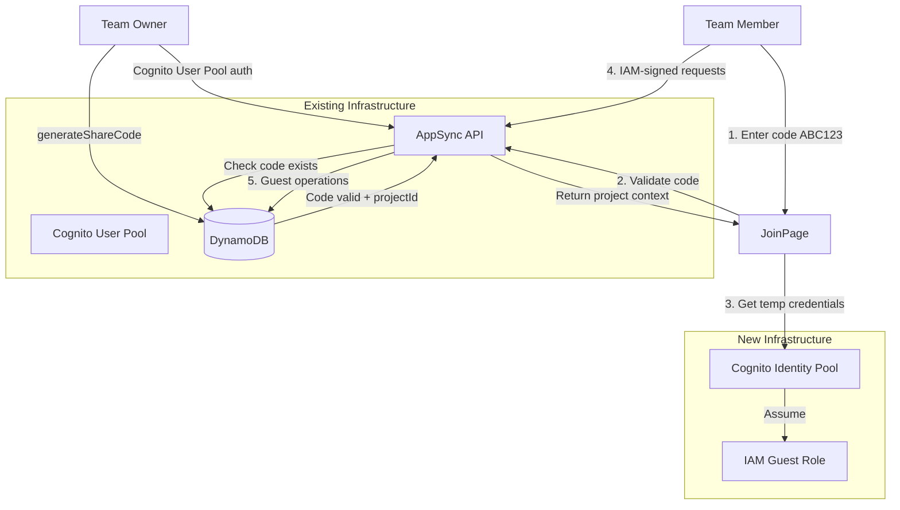
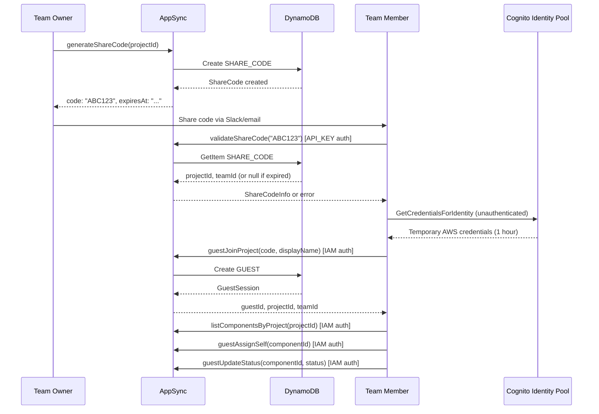

# Team Member Task View + Share Code Feature

## Overview

Two related features:

1. **Share Code System** - Frictionless team joining using Cognito Identity Pool (AWS best practice)
2. **Member Workload View** - Owners can see each member's assignments

## AWS Documentation References

- [Cognito Identity Pool Security Best Practices](https://docs.aws.amazon.com/cognito/latest/developerguide/identity-pools-security-best-practices.html)
- [AppSync IAM Authorization](https://docs.aws.amazon.com/appsync/latest/devguide/security-iam.html)
- [DynamoDB TTL](https://docs.aws.amazon.com/amazondynamodb/latest/developerguide/TTL.html)
- [CDK Identity Pool Module](https://docs.aws.amazon.com/cdk/api/v2/docs/aws-cdk-lib.aws_cognito_identitypool-readme.html)
- [Example: cdk-appsync-guests](https://github.com/focusOtter/cdk-appsync-guests)

---

## Part 1: Share Code System (Cognito Identity Pool)

### Architecture




### User Flow




### CDK Infrastructure Changes

#### 1. Enable DynamoDB TTL (1 line change)

In [dynamodb.ts](cdk/lib/constructs/dynamodb.ts):

```typescript
this.table = new Table(this, 'Table', {
  // ... existing config
  timeToLiveAttribute: 'ttl',  // <-- ADD THIS
});
```

#### 2. Create Identity Pool with Guest Role

New file `cdk/lib/constructs/identity-pool.ts`:

```typescript
import { IdentityPool, IdentityPoolAuthenticationProviders } from 'aws-cdk-lib/aws-cognito-identitypool';
import { Role, PolicyStatement, Effect } from 'aws-cdk-lib/aws-iam';

export class GuestIdentityPool extends Construct {
  public readonly identityPool: IdentityPool;

  constructor(scope: Construct, id: string, props: { appSyncApi: GraphqlApi }) {
    super(scope, id);

    // Create Identity Pool with unauthenticated access enabled
    this.identityPool = new IdentityPool(this, 'IdentityPool', {
      identityPoolName: `${Stack.of(this).stackName}-GuestPool`,
      allowUnauthenticatedIdentities: true,  // Enable guest access
    });

    // Configure guest IAM role with limited AppSync permissions
    this.identityPool.unauthenticatedRole.addToPrincipalPolicy(
      new PolicyStatement({
        effect: Effect.ALLOW,
        actions: ['appsync:GraphQL'],
        resources: [
          // Only allow specific guest operations
          `${props.appSyncApi.arn}/types/Query/fields/validateShareCode`,
          `${props.appSyncApi.arn}/types/Mutation/fields/guestJoinProject`,
          `${props.appSyncApi.arn}/types/Query/fields/guestGetProject`,
          `${props.appSyncApi.arn}/types/Query/fields/guestListComponents`,
          `${props.appSyncApi.arn}/types/Mutation/fields/guestAssignSelf`,
          `${props.appSyncApi.arn}/types/Mutation/fields/guestUnassignSelf`,
          `${props.appSyncApi.arn}/types/Mutation/fields/guestUpdateStatus`,
          `${props.appSyncApi.arn}/types/Query/fields/guestListAssignments`,
        ],
      })
    );
  }
}
```

#### 3. AppSync IAM Authorization Mode (already exists)

The AppSync API already has IAM as an additional auth mode - no change needed.

### DynamoDB Data Model

Add to existing single-table (follows [AWS single-table design best practices](https://docs.aws.amazon.com/amazondynamodb/latest/developerguide/bp-general-nosql-design.html)):

```
ShareCode (auto-expires via TTL):
  pk: SHARE_CODE#<code>
  sk: METADATA
  projectId: string
  teamId: string
  createdBy: string
  ttl: number (Unix epoch - triggers auto-delete)
  createdAt: string

GuestUser:
  pk: GUEST#<guestId>
  sk: METADATA
  displayName: string
  projectId: string
  teamId: string
  cognitoIdentityId: string (from Identity Pool)
  createdAt: string
  lastActiveAt: string

GuestMembership:
  pk: TEAM#<teamId>
  sk: MEMBER#GUEST#<guestId>
  role: GUEST
  isGuest: true
  displayName: string
  projectId: string (scope to single project)
```

### GraphQL Schema Additions

```graphql
# Share code for project access
type ShareCode {
  code: String!
  projectId: ID!
  teamId: ID!
  expiresAt: String!
  createdAt: String!
}

# Result of validating a share code (unauthenticated)
type ShareCodeInfo {
  valid: Boolean!
  projectId: ID
  projectName: String
  teamId: ID
  teamName: String
  expiresAt: String
}

# Guest session after joining
type GuestSession {
  guestId: ID!
  displayName: String!
  projectId: ID!
  teamId: ID!
}

input GenerateShareCodeInput {
  projectId: ID!
  expiresInHours: Int  # default 168 (7 days), max 720 (30 days)
}

input GuestJoinInput {
  code: String!
  displayName: String!
}

type Query {
  # Validate share code (unauthenticated - API_KEY)
  validateShareCode(code: String!): ShareCodeInfo! @aws_api_key

  # Guest operations (IAM auth from Identity Pool)
  guestGetProject(guestId: ID!): Project @aws_iam
  guestListComponents(guestId: ID!): [Component!]! @aws_iam
  guestListAssignments(guestId: ID!): [AssignmentWithComponent!]! @aws_iam
}

type Mutation {
  # Owner generates share code (Cognito auth)
  generateShareCode(input: GenerateShareCodeInput!): ShareCode!
  
  # Owner revokes share code
  revokeShareCode(code: String!): Boolean!

  # Guest joins with code (IAM auth)
  guestJoinProject(input: GuestJoinInput!): GuestSession! @aws_iam
  
  # Guest self-assigns to component
  guestAssignSelf(guestId: ID!, componentId: ID!): Assignment! @aws_iam
  
  # Guest unassigns self from component  
  guestUnassignSelf(guestId: ID!, componentId: ID!): Boolean! @aws_iam
  
  # Guest updates status on own assignment
  guestUpdateStatus(guestId: ID!, componentId: ID!, status: ComponentStatus!): Component! @aws_iam
}
```

### Guest Permissions


| Action                           | Allowed | Resolver Validation                  |
| -------------------------------- | ------- | ------------------------------------ |
| View project details             | Yes     | guestId must belong to project       |
| View all components              | Yes     | guestId must belong to project       |
| Self-assign to component         | Yes     | Component must be in guest's project |
| Unassign self                    | Yes     | Must be own assignment               |
| Update status on own assignments | Yes     | Must be own assignment               |
| Create components                | No      | Not in IAM policy                    |
| Delete components                | No      | Not in IAM policy                    |
| Assign others                    | No      | Resolver rejects                     |
| Change others' assignments       | No      | Resolver rejects                     |


### Security (AWS Best Practices)

1. **Cognito Identity Pool with Unauthenticated Role**
  - Temporary credentials (1 hour expiry, auto-refresh)
  - IAM-scoped to specific AppSync operations only
  - CloudTrail audit trail for all API calls
2. **DynamoDB TTL for Code Expiration**
  - Codes auto-delete after expiry (no manual cleanup)
  - Resolver also checks `ttl > now()` for defense in depth
3. **Rate Limiting**
  - WAF already protects AppSync endpoint
  - Add resolver-level rate limit for validateShareCode (optional)
4. **Resolver Authorization**
  - Each guest operation validates guestId matches Cognito Identity ID
  - Cross-project access blocked at resolver level

### Files to Create/Modify


| File                                                | Change                                    |
| --------------------------------------------------- | ----------------------------------------- |
| `cdk/lib/constructs/dynamodb.ts`                    | Add `timeToLiveAttribute: 'ttl'`          |
| `cdk/lib/constructs/identity-pool.ts`               | New: Cognito Identity Pool + guest role   |
| `cdk/lib/main-stack.ts`                             | Wire up Identity Pool                     |
| `cdk/lib/constructs/appsync-graphql/schema.graphql` | Add share code + guest types              |
| `cdk/lib/constructs/appsync-graphql.ts`             | Add resolvers for guest operations        |
| `webapp-static/src/config.ts`                       | Add Identity Pool ID                      |
| `webapp-static/src/hooks/useGuestAuth.ts`           | New: manage guest credentials via Amplify |
| `webapp-static/src/api/appsync.ts`                  | Add guest API functions                   |
| `webapp-static/src/pages/JoinPage.tsx`              | New: enter code + name form               |
| `webapp-static/src/pages/GuestDashboardPage.tsx`    | New: view/self-assign/update status       |
| `webapp-static/src/components/ShareCodeModal.tsx`   | New: owner generates/copies code          |
| `webapp-static/src/pages/ProjectDetailPage.tsx`     | Add "Share" button for owners             |


---

## Part 2: Member Workload View (for authenticated owners)

### Implementation

Add to TeamDetailPage:

- Click any member → modal shows their assigned tasks
- Uses existing `listAssignmentsForUser` pattern but scoped to team

### GraphQL Addition

```graphql
type Query {
  # List assignments for a specific team member (requires team membership)
  listAssignmentsForTeamMember(teamId: ID!, userId: ID!): [AssignmentWithComponent!]!
}
```

### Files to Modify


| File                                                   | Change                 |
| ------------------------------------------------------ | ---------------------- |
| `cdk/lib/constructs/appsync-graphql/schema.graphql`    | Add query              |
| `webapp-static/src/components/MemberWorkloadModal.tsx` | New modal              |
| `webapp-static/src/pages/TeamDetailPage.tsx`           | Make members clickable |


---

## Implementation Order

1. **Phase 1**: DynamoDB TTL + Identity Pool infrastructure
2. **Phase 2**: Share code generation/validation (owner flow)
3. **Phase 3**: Guest join + view-only access
4. **Phase 4**: Guest self-assignment + status updates + unassign
5. **Phase 5**: Member workload modal for owners

