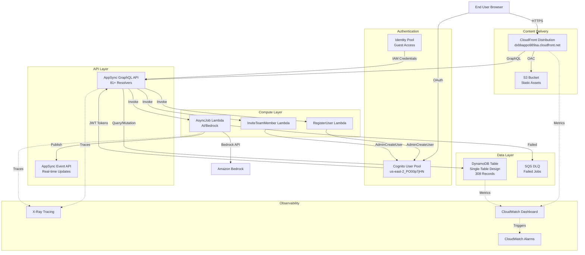
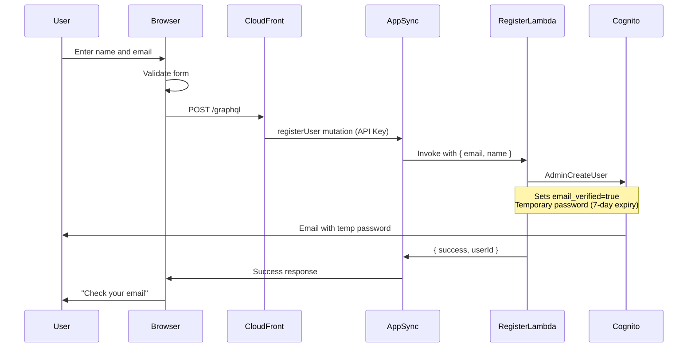
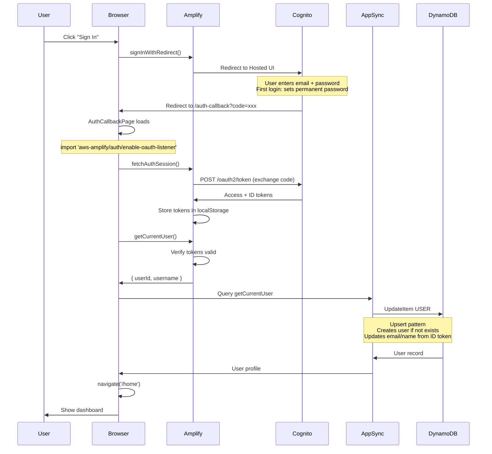
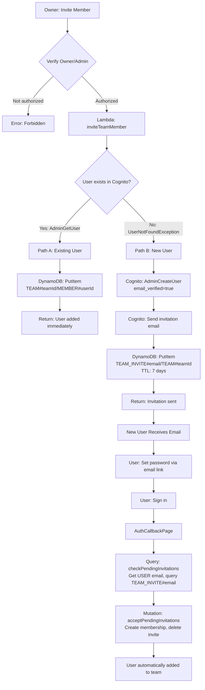
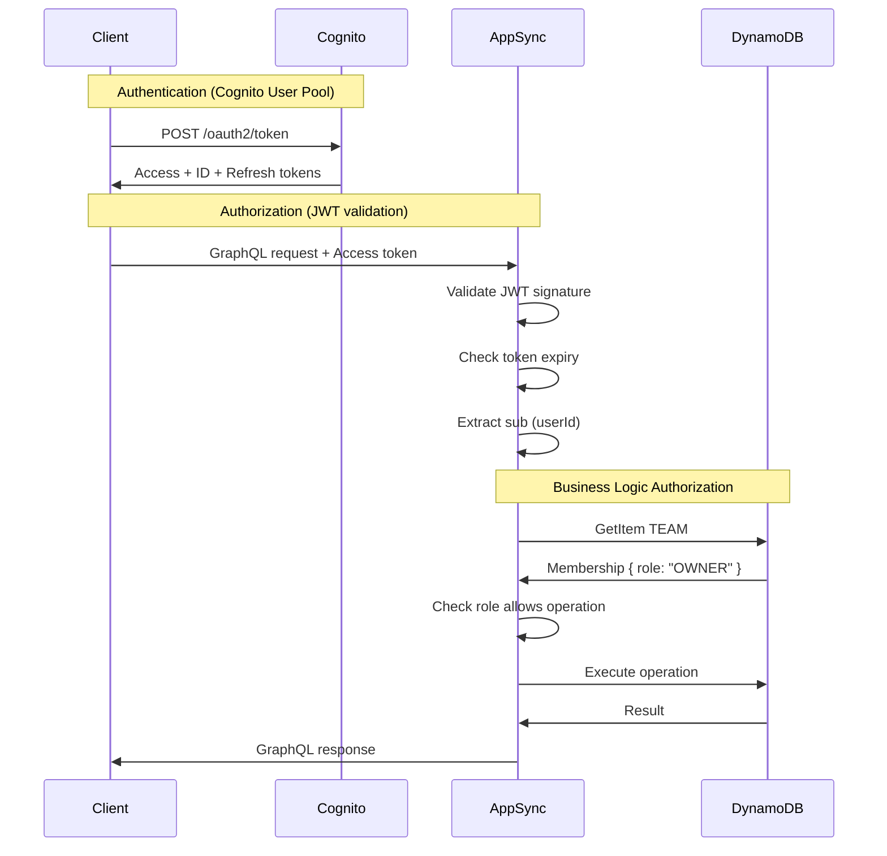

# TaskTitan Technical Architecture Documentation

**Version**: 3.0 (Simplified Team-Only System)  
**Last Updated**: February 2, 2026  
**Stack**: TaskTitanForgeStack (us-east-2)

---

## Table of Contents

1. [System Overview](#system-overview)
2. [AWS Services Configuration](#aws-services-configuration)
3. [User Authentication Flows](#user-authentication-flows)
4. [Data Model](#data-model)
5. [Security Architecture](#security-architecture)
6. [Configuration Decisions](#configuration-decisions)
7. [Known Limitations](#known-limitations)
8. [Troubleshooting Guide](#troubleshooting-guide)
9. [Monitoring and Operations](#monitoring-and-operations)

---

## System Overview

TaskTitan is a serverless project management application built entirely on AWS managed services. The architecture follows AWS Well-Architected Framework principles with emphasis on security, scalability, and operational excellence.

### Architecture Diagram



### Technology Stack

| Layer | Service | Version/Type | Purpose |
|-------|---------|--------------|---------|
| **CDN** | Amazon CloudFront | HTTP/2 + HTTP/3 | Global content delivery, HTTPS enforcement |
| **Storage** | Amazon S3 | Standard class | Static website hosting (React SPA) |
| **Auth** | Amazon Cognito User Pool | Managed service | User authentication, OAuth provider |
| **Auth** | Amazon Cognito Identity Pool | Managed service | Guest (unauthenticated) access |
| **API** | AWS AppSync | GraphQL | Primary application API |
| **API** | AWS AppSync Event API | WebSocket | Real-time updates |
| **Compute** | AWS Lambda | Node.js 20.x | User registration, team invitations, AI jobs |
| **Database** | Amazon DynamoDB | On-demand capacity | Single-table design, 3 GSIs |
| **Queue** | Amazon SQS | Standard queue | Dead letter queue for failed jobs |
| **Monitoring** | Amazon CloudWatch | Managed service | Metrics, logs, dashboards, alarms |
| **Tracing** | AWS X-Ray | Managed service | Distributed request tracing |
| **AI** | Amazon Bedrock | Claude 3 models | AI-powered component generation |

### Deployment Model

**Region**: us-east-2 (Ohio) for all services except:
- **WAF**: us-east-1 (required for CloudFront scope)

**Serverless Architecture Benefits**:
- No server management or patching
- Automatic scaling (DynamoDB on-demand, Lambda auto-scaling)
- Pay-per-use pricing model
- High availability built-in (multi-AZ)
- Zero maintenance windows

**Infrastructure as Code**: AWS CDK (TypeScript)
- Stack: `TaskTitanForgeStack`
- Deterministic deployments
- Version controlled infrastructure

---

## AWS Services Configuration

### 1. Amazon Cognito User Pool

**Service Documentation**: https://docs.aws.amazon.com/cognito/latest/developerguide/cognito-user-identity-pools.html

**Stack Output**:
- User Pool ID: `us-east-2_PO00p7jHN`
- Client ID: `3n1ccf1u93crsjg7qklud53dgp`
- Domain: `webapp-b390c1b1fb.auth.us-east-2.amazoncognito.com`

**Configuration** ([`cdk/lib/constructs/auth/index.ts`](cdk/lib/constructs/auth/index.ts)):

```typescript
// Password Policy (AWS Best Practice: Strong password requirements)
passwordPolicy: {
  minLength: 8,
  requireLowercase: true,
  requireUppercase: true,
  requireDigits: true,
  requireSymbols: true,
}

// Sign-in Configuration
signInAliases: {
  email: true,      // Users sign in with email
  username: false,  // No username-based auth
}

// Self Sign-Up: DISABLED
// Rationale: Admin-controlled user creation via AdminCreateUser
// Users are created via:
//   1. registerUser mutation (new sign-ups)
//   2. inviteTeamMember mutation (team invitations)
selfSignUpEnabled: false

// Account Recovery
accountRecovery: AccountRecovery.EMAIL_ONLY

// Email Verification
autoVerify: { email: true }
```

**OAuth 2.0 Configuration** (Authorization Code Flow):
- **Grant Type**: Authorization Code (most secure OAuth flow)
- **Scopes**: `profile`, `phone`, `email`, `openid`, `aws.cognito.signin.user.admin`
- **Callback URLs**: Updated dynamically via CDK CustomResource
  - Development: `http://localhost:5173/auth-callback`
  - Production CloudFront: `https://dxbbappo989sa.cloudfront.net/auth-callback`
  - Custom Domain: `https://tasktitan.live/auth-callback`
- **Logout URLs**: Corresponding base URLs
- **Response Type**: `code` (returns authorization code, not tokens directly)

**AWS Reference**: [OAuth 2.0 Authorization Code Flow](https://docs.aws.amazon.com/cognito/latest/developerguide/amazon-cognito-user-pools-authentication-flow.html#amazon-cognito-user-pools-authorization-code-grant-flow)

**Token Validity**:
- **ID Token**: 1 day (1440 minutes) - Contains user attributes (email, name)
- **Access Token**: 1 hour (60 minutes) - Used for API authorization
- **Refresh Token**: 30 days - Used to obtain new access tokens

**AWS Reference**: [Using Tokens with User Pools](https://docs.aws.amazon.com/cognito/latest/developerguide/amazon-cognito-user-pools-using-tokens-with-identity-providers.html)

**Email Templates**:

1. **User Invitation Template** (AdminCreateUser):
```
Subject: Your invitation to TaskTitan
Body: 
  You've been invited to TaskTitan.
  Username: {username}
  Temporary password: {####}
  Password expires in 7 days.
```

2. **Verification Email Template**:
```
Subject: Verify your TaskTitan account
Body: Your verification code is {####}
```

**Security Settings**:
- **Token Revocation**: Enabled (tokens can be revoked on sign-out)
- **Managed Login**: NEWER_MANAGED_LOGIN version
- **Removal Policy**: RETAIN (preserves users if stack deleted)

**AWS Reference**: [User Pool Security](https://docs.aws.amazon.com/cognito/latest/developerguide/managing-security.html)

---

### 2. AWS AppSync GraphQL API

**Service Documentation**: https://docs.aws.amazon.com/appsync/latest/devguide/

**Stack Output**:
- API URL: `https://d66gi4akqjbbhl4lw4ubv75bfa.appsync-api.us-east-2.amazonaws.com/graphql`
- API ID: `jl5d74qorna53hqourvxta5ioi`
- API Key: `da2-xo7ki2ndgnacldaxbfyjlsioum` (365-day expiry)

**Authorization Modes** ([`cdk/lib/constructs/appsync-graphql.ts`](cdk/lib/constructs/appsync-graphql.ts)):

1. **Primary: Cognito User Pools** (default)
   - Uses JWT access tokens from Cognito
   - Validates `sub` claim against User Pool
   - Used for all authenticated operations
   - **AWS Reference**: [Cognito User Pool Authorization](https://docs.aws.amazon.com/appsync/latest/devguide/security-authz.html#amazon-cognito-user-pools-authorization)

2. **Secondary: API Key**
   - Limited to `registerUser` mutation only
   - No authentication required
   - 365-day expiry (auto-rotates via CDK)
   - **AWS Reference**: [API Key Authorization](https://docs.aws.amazon.com/appsync/latest/devguide/security-authz.html#api-key-authorization)

3. **Tertiary: IAM**
   - Lambda-to-AppSync calls (`publishAIProgress` subscription)
   - Guest access via Cognito Identity Pool
   - Scoped IAM policies (least privilege)
   - **AWS Reference**: [IAM Authorization](https://docs.aws.amazon.com/appsync/latest/devguide/security-authz.html#aws-iam-authorization)

**Data Sources**:

1. **DynamoDB Data Source** (`dynamoDs`)
   - **Table**: TaskTitanForgeStack-TaskTitan
   - **Permissions**: Query, GetItem, PutItem, UpdateItem, DeleteItem, BatchGetItem, BatchWriteItem, TransactWriteItems
   - **Use**: Direct resolver access for most operations

2. **Lambda Data Source** (`registerUserDs`)
   - **Function**: register-user-handler
   - **Purpose**: AdminCreateUser for new user sign-ups
   - **Permissions**: InvokeFunction

3. **Lambda Data Source** (`inviteTeamMemberDs`)
   - **Function**: invite-team-member-handler
   - **Purpose**: AdminCreateUser for team invitations
   - **Permissions**: InvokeFunction

4. **Lambda Data Source** (`lambdaDs`)
   - **Function**: AsyncJobHandler
   - **Purpose**: AI/Bedrock integration for component generation
   - **Permissions**: InvokeFunction

5. **None Data Source** (`noneDs`)
   - **Purpose**: Subscriptions (no data source needed)
   - **Use**: `onAIProgress` subscription

**Resolver Pattern**: JavaScript Resolvers (Runtime v1.0.0)
- **AWS Reference**: [AppSync JavaScript Resolvers](https://docs.aws.amazon.com/appsync/latest/devguide/resolver-reference-overview-js.html)

**Security Features**:
- **X-Ray Tracing**: Enabled for all resolvers
- **Field-level authorization**: `@aws_cognito_user_pools`, `@aws_iam`, `@aws_api_key` directives
- **Scoped IAM permissions**: Lambda can only call `publishAIProgress` mutation

**AWS Reference**: [AppSync Security](https://docs.aws.amazon.com/appsync/latest/devguide/security.html)

---

### 3. Amazon DynamoDB Single-Table Design

**Service Documentation**: https://docs.aws.amazon.com/amazondynamodb/latest/developerguide/

**Stack Output**:
- Table Name: `TaskTitanForgeStack-TaskTitan`
- Table ARN: `arn:aws:dynamodb:us-east-2:232894901916:table/TaskTitanForgeStack-TaskTitan`
- Item Count: 308 production records

**Configuration** ([`cdk/lib/constructs/dynamodb.ts`](cdk/lib/constructs/dynamodb.ts)):

```typescript
// Billing Mode: On-Demand (automatic scaling)
billing: BillingMode.PAY_PER_REQUEST

// Primary Key
partitionKey: { name: 'pk', type: AttributeType.STRING }
sortKey: { name: 'sk', type: AttributeType.STRING }

// Encryption: AWS-managed keys
encryption: TableEncryption.AWS_MANAGED

// Data Protection
pointInTimeRecovery: true  // 35-day continuous backups
removalPolicy: RemovalPolicy.RETAIN  // Prevents accidental data loss

// Change Data Capture
stream: StreamViewType.NEW_AND_OLD_IMAGES  // For real-time updates

// Auto-Expiration
timeToLiveAttribute: 'ttl'  // Automatic cleanup (invitations)

// Performance Insights
contributorInsightsEnabled: true  // Identify hot partitions
```

**AWS Best Practice Reference**: [Single-Table Design](https://docs.aws.amazon.com/amazondynamodb/latest/developerguide/bp-general-nosql-design.html#bp-general-nosql-design-concepts)

**Rationale for Single-Table**:
- Reduces costs (fewer tables)
- Atomic transactions across entity types
- Simplified access patterns
- Better performance (fewer round-trips)

**Entity Access Patterns**:

| Entity | Partition Key (pk) | Sort Key (sk) | Access Pattern |
|--------|-------------------|---------------|----------------|
| User | `USER#<userId>` | `METADATA` | GetItem by userId |
| Team | `TEAM#<teamId>` | `METADATA` | GetItem by teamId |
| Team Membership | `TEAM#<teamId>` | `MEMBER#<userId>` | Query team members |
| Project | `PROJECT#<projectId>` | `METADATA` | GetItem by projectId |
| Component | `COMPONENT#<componentId>` | `METADATA` | GetItem by componentId |
| Assignment | `COMPONENT#<componentId>` | `ASSIGNEE#<userId>` | Query component assignees |
| Dependency | `COMPONENT#<fromId>` | `DEPENDS_ON#<toId>` | Query component dependencies |
| Sprint | `SPRINT#<sprintId>` | `METADATA` | GetItem by sprintId |
| Notification | `USER#<userId>` | `NOTIFICATION#<timestamp>#<id>` | Query user notifications (time-ordered) |
| Team Invitation | `TEAM_INVITE#<email>` | `TEAM#<teamId>` | Query pending invites by email |
| Activity | `PROJECT#<projectId>` | `ACTIVITY#<timestamp>#<id>` | Query project activities (time-ordered) |

**Global Secondary Indexes**:

**GSI1** (`gsi1pk`, `gsi1sk`) - Cross-Entity Lookups:

| Access Pattern | GSI1 PK | GSI1 SK | Query Type |
|----------------|---------|---------|------------|
| Find user by email | `EMAIL#<email>` | `USER#<userId>` | Query (LIMIT 1) |
| List user's teams | `USER#<userId>` | `TEAM#<teamId>` | Query |
| List user's assignments | `USER#<userId>` | `ASSIGNMENT#<componentId>` | Query |
| List projects by owner | `OWNER#<userId>` | `PROJECT#<projectId>` | Query |
| List team invitations | `TEAM#<teamId>` | `INVITE#<email>#<timestamp>` | Query |

**GSI2** (`gsi2pk`, `gsi2sk`) - Sprint and Status Queries:

| Access Pattern | GSI2 PK | GSI2 SK | Query Type |
|----------------|---------|---------|------------|
| List sprint components | `SPRINT#<sprintId>` | `COMPONENT#<componentId>` | Query |
| List components by status | `PROJECT#<id>#STATUS#<status>` | `COMPONENT#<componentId>` | Query |
| List component children | `PARENT#<parentId>` | `COMPONENT#<componentId>` | Query |
| List team projects | `TEAM#<teamId>` | `PROJECT#<projectId>` | Query |

**GSI3** (`gsi3pk`, `gsi3sk`) - GitHub Integration (Sparse Index):

| Access Pattern | GSI3 PK | GSI3 SK | Query Type |
|----------------|---------|---------|------------|
| Find project by GitHub repo | `GITHUB_REPO#<url>` | `PROJECT#<projectId>` | Query (LIMIT 1) |

**AWS Reference**: [Global Secondary Indexes](https://docs.aws.amazon.com/amazondynamodb/latest/developerguide/GSI.html)

**TTL Strategy** (Auto-Expiration):
- **Attribute**: `ttl` (Unix epoch timestamp)
- **Use case**: Team invitations expire after 7 days
- **Pattern**: `ttl: nowEpoch + (7 * 24 * 3600)`
- **Benefit**: Automatic cleanup, no manual deletion needed

**AWS Reference**: [Time To Live](https://docs.aws.amazon.com/amazondynamodb/latest/developerguide/TTL.html)

---

### 4. Amazon CloudFront + S3 Static Hosting

**Service Documentation**: https://docs.aws.amazon.com/cloudfront/latest/DeveloperGuide/

**Stack Outputs**:
- Distribution: `E1KOW34S6BCM4J`
- Domain: `dxbbappo989sa.cloudfront.net`
- S3 Bucket: `tasktitanforgestack-staticfrontendbucket37767dd7-0f0cvbckhzxv`

**S3 Bucket Configuration** ([`cdk/lib/constructs/static-frontend.ts`](cdk/lib/constructs/static-frontend.ts)):

```typescript
// Security: Private bucket, CloudFront-only access
blockPublicAccess: BlockPublicAccess.BLOCK_ALL
enforceSSL: true  // Reject non-HTTPS uploads

// Encryption: S3-managed keys
encryption: BucketEncryption.S3_MANAGED

// Ownership: Required for Origin Access Control (OAC)
objectOwnership: ObjectOwnership.BUCKET_OWNER_ENFORCED

// Lifecycle: Can be recreated from source code
removalPolicy: RemovalPolicy.DESTROY
autoDeleteObjects: true
```

**AWS Reference**: [S3 Security Best Practices](https://docs.aws.amazon.com/AmazonS3/latest/userguide/security-best-practices.html)

**CloudFront Distribution Configuration**:

```typescript
// Default Behavior (index.html and routes)
defaultBehavior: {
  origin: S3BucketOrigin.withOriginAccessControl(bucket),
  viewerProtocolPolicy: ViewerProtocolPolicy.REDIRECT_TO_HTTPS,
  cachePolicy: CachePolicy.CACHING_DISABLED,  // No cache for index.html
  allowedMethods: AllowedMethods.ALLOW_GET_HEAD_OPTIONS,
}

// Hashed Assets Behavior (/assets/*)
additionalBehaviors: {
  '/assets/*': {
    cachePolicy: CachePolicy.CACHING_OPTIMIZED,  // Long cache (1 year)
    // Vite generates hashed filenames (cache-busting built-in)
  }
}

// SPA Routing (client-side routing support)
errorResponses: [
  { httpStatus: 403, responseHttpStatus: 200, responsePagePath: '/index.html' },
  { httpStatus: 404, responseHttpStatus: 200, responsePagePath: '/index.html' },
]

// Performance
priceClass: PriceClass.PRICE_CLASS_100  // North America + Europe
httpVersion: HttpVersion.HTTP2_AND_3     // Modern protocols
```

**AWS Reference**: [CloudFront Best Practices](https://docs.aws.amazon.com/AmazonCloudFront/latest/DeveloperGuide/best-practices.html)

**Security Headers Policy**:

```typescript
// Content Security Policy
contentSecurityPolicy: "default-src 'self'; script-src 'self' 'unsafe-inline'; ..."

// Security Headers
contentTypeOptions: nosniff                    // Prevent MIME sniffing
frameOptions: DENY                             // Clickjacking protection
strictTransportSecurity: max-age=31536000      // Force HTTPS (1 year)
xssProtection: enabled, mode=block             // XSS protection
referrerPolicy: strict-origin-when-cross-origin
```

**AWS Reference**: [Security Headers](https://docs.aws.amazon.com/AmazonCloudFront/latest/DeveloperGuide/adding-response-headers.html)

**Origin Access Control (OAC)**:
- Replaces legacy Origin Access Identity (OAI)
- S3 bucket permissions granted only to CloudFront
- Supports SSE-S3 encryption

**AWS Reference**: [Restricting S3 Access](https://docs.aws.amazon.com/AmazonCloudFront/latest/DeveloperGuide/private-content-restricting-access-to-s3.html)

---

### 5. AWS Lambda Functions

**Service Documentation**: https://docs.aws.amazon.com/lambda/latest/dg/

#### RegisterUser Handler

**Purpose**: Create new Cognito users via AdminCreateUser

**Configuration**:
```typescript
// Runtime
runtime: lambda.Runtime.NODEJS_20_X
architecture: lambda.Architecture.ARM_64  // Graviton2 (better price/performance)

// Resources
timeout: Duration.seconds(30)
memorySize: 256

// Environment Variables
USER_POOL_ID: auth.userPool.userPoolId
```

**Code**: [`cdk/lib/constructs/appsync-graphql/register-user-handler.ts`](cdk/lib/constructs/appsync-graphql/register-user-handler.ts)

**Flow**:
1. Receives `{ email, name }` from AppSync
2. Validates email format
3. Calls Cognito `AdminCreateUserCommand`
4. Sets attributes: `email`, `email_verified=true`, `name`
5. Cognito sends invitation email with temporary password
6. Returns `{ success, message, userId }`

**IAM Permissions**:
- `cognito-idp:AdminCreateUser`

**AWS API Reference**: [AdminCreateUser](https://docs.aws.amazon.com/cognito-user-identity-pools/latest/APIReference/API_AdminCreateUser.html)

#### InviteTeamMember Handler

**Purpose**: Invite users to teams (creates Cognito user if needed)

**Configuration**:
```typescript
runtime: lambda.Runtime.NODEJS_20_X
timeout: Duration.seconds(30)
memorySize: 256

environment: {
  USER_POOL_ID: auth.userPool.userPoolId
}
```

**Code**: [`cdk/lib/constructs/appsync-graphql/invite-team-member-handler.ts`](cdk/lib/constructs/appsync-graphql/invite-team-member-handler.ts)

**Flow**:
1. Receives `{ email, teamId, role, title }` from AppSync
2. Normalizes email (toLowerCase, trim)
3. Checks if user exists: `AdminGetUserCommand`
   - **If exists**: Returns `{ userExists: true, userId }`
   - **If not exists**: Calls `AdminCreateUserCommand` with email verification
4. Cognito sends invitation email if new user
5. Returns `{ success, userExists, userId? }`

**IAM Permissions**:
- `cognito-idp:AdminGetUser`
- `cognito-idp:AdminCreateUser`

**Race Condition Handling**:
- Catches `UsernameExistsException` (user created between check and create)
- Retries `AdminGetUser` to get userId

#### AsyncJob Handler

**Purpose**: AI component generation via Amazon Bedrock

**Configuration**:
```typescript
// Docker-based Lambda for larger dependencies
code: lambda.DockerImageCode.fromImageAsset(...)
architecture: lambda.Architecture.ARM_64
memorySize: 1024
timeout: Duration.minutes(10)  // Long timeout for AI operations

// Concurrency
reservedConcurrentExecutions: 100

// Retry Policy
onFailure: new SqsDestination(dlq)
retryAttempts: 2
```

**IAM Permissions**:
- `bedrock:InvokeModel` (Claude models)
- `dynamodb:GetItem`, `dynamodb:PutItem`
- `events:PutEvents` (publish to EventBridge)
- `translate:TranslateText`, `comprehend:DetectSentiment`

**DLQ Configuration**:
- **Service**: Amazon SQS
- **Retention**: 14 days
- **Encryption**: AWS KMS managed key

**AWS Reference**: [Lambda Destinations](https://docs.aws.amazon.com/lambda/latest/dg/invocation-async.html#invocation-async-destinations)

---

## User Authentication Flows

### Sign-Up Flow



**AWS Documentation References**:
- **AdminCreateUser**: https://docs.aws.amazon.com/cognito-user-identity-pools/latest/APIReference/API_AdminCreateUser.html
- **Email Templates**: https://docs.aws.amazon.com/cognito/latest/developerguide/cognito-user-pool-settings-message-templates.html

**GraphQL Mutation**:
```graphql
mutation RegisterUser($input: RegisterUserInput!) {
  registerUser(input: $input) {
    success
    message
    userId
  }
}
```

**Authorization**: `@aws_api_key` (unauthenticated operation)

**Key Design Decision**: 
- **Self-signup disabled** in Cognito
- All users created via `AdminCreateUser` (controlled onboarding)
- Email automatically verified (no verification code step)

---

### Sign-In Flow (OAuth 2.0 Authorization Code)



**AWS Documentation References**:
- **OAuth 2.0 Authorization Code Flow**: https://docs.aws.amazon.com/cognito/latest/developerguide/amazon-cognito-user-pools-authentication-flow.html#amazon-cognito-user-pools-authorization-code-grant-flow
- **Cognito Hosted UI**: https://docs.aws.amazon.com/cognito/latest/developerguide/cognito-user-pools-app-integration.html
- **Token Exchange**: https://docs.aws.amazon.com/cognito/latest/developerguide/token-endpoint.html

**OAuth Endpoints**:
```
Authorization: https://webapp-b390c1b1fb.auth.us-east-2.amazoncognito.com/oauth2/authorize
Token Exchange: https://webapp-b390c1b1fb.auth.us-east-2.amazoncognito.com/oauth2/token
```

**Amplify Configuration** ([`webapp-static/src/config.ts`](webapp-static/src/config.ts)):

```typescript
oauth: {
  domain: 'webapp-b390c1b1fb.auth.us-east-2.amazoncognito.com',
  // AWS Requirement: Array of all possible redirect URLs
  // Amplify automatically selects correct one based on window.location.origin
  redirectSignIn: [
    'http://localhost:5173/auth-callback',
    'https://dxbbappo989sa.cloudfront.net/auth-callback',
    'https://tasktitan.live/auth-callback',
  ],
  redirectSignOut: [
    'http://localhost:5173',
    'https://dxbbappo989sa.cloudfront.net',
    'https://tasktitan.live',
  ],
  responseType: 'code',  // Authorization code flow (most secure)
  scopes: ['profile', 'openid', 'email', 'aws.cognito.signin.user.admin'],
}
```

**AWS Amplify Reference**: [Social Provider Sign-In](https://docs.amplify.aws/gen1/react/build-a-backend/auth/add-social-provider/)

**Critical Implementation Detail** - Multi-Page Application:

Per AWS documentation, multi-page applications (React Router) require explicit OAuth listener import:

```typescript
// In AuthCallbackPage.tsx
import 'aws-amplify/auth/enable-oauth-listener';
```

**Why**: The OAuth listener is added as a side-effect when `signInWithRedirect()` is imported. In React Router, the callback page is a different "page" (component) than the sign-in page, so the listener would be lost without this import.

**AWS Reference**: [Multi-Page OAuth](https://docs.amplify.aws/gen1/react/build-a-backend/auth/add-social-provider/#required-for-multi-page-applications-complete-social-sign-in-after-redirect)

**Token Types and Usage**:

**Access Token** (used by AppSync):
```json
{
  "sub": "54288468-e051-706d-a73f-03892273d7e9",
  "cognito:username": "user@example.com",
  "token_use": "access",
  "scope": "aws.cognito.signin.user.admin",
  "auth_time": 1738546800,
  "exp": 1738550400
}
```
- **Purpose**: Authorization (API access)
- **Does NOT contain**: email, name (user attributes)
- **Sent to**: AppSync in Authorization header

**ID Token** (used by frontend):
```json
{
  "sub": "54288468-e051-706d-a73f-03892273d7e9",
  "email": "user@example.com",
  "email_verified": true,
  "name": "User Name",
  "cognito:username": "user@example.com",
  "token_use": "id"
}
```
- **Purpose**: User information (PII)
- **Contains**: email, name, verification status
- **Used in**: Frontend to extract user attributes
- **Never sent to backend** (contains PII)

**AWS Reference**: [Using Tokens](https://docs.aws.amazon.com/cognito/latest/developerguide/amazon-cognito-user-pools-using-tokens-with-identity-providers.html)

**Why Both Tokens Matter**:
- AppSync sees **access token only** (no email/name)
- Frontend extracts email/name from **ID token**
- `syncUserProfile` mutation sends email/name to DynamoDB
- Allows `getCurrentUser` resolver to populate user profile

---

### Team Invitation Flow



**AWS Documentation References**:
- **AdminGetUser**: https://docs.aws.amazon.com/cognito-user-identity-pools/latest/APIReference/API_AdminGetUser.html
- **AdminCreateUser**: https://docs.aws.amazon.com/cognito/latest/developerguide/how-to-create-user-accounts.html
- **Conditional Writes**: https://docs.aws.amazon.com/amazondynamodb/latest/developerguide/Expressions.ConditionExpressions.html

**GraphQL Operations**:

1. **inviteTeamMember** (Pipeline Resolver):
```graphql
mutation InviteTeamMember($input: InviteTeamMemberInput!) {
  inviteTeamMember(input: $input)
}

input InviteTeamMemberInput {
  email: String!
  teamId: ID!
  role: MemberRole!  # OWNER | ADMIN | MEMBER | VIEWER
  title: String      # Optional job title
}
```

**Pipeline Steps**:
- Step 1: Verify caller is OWNER or ADMIN (DynamoDB GetItem)
- Step 2: Call Lambda to check/create Cognito user
- Step 3: Add to team (if exists) OR create invitation (if new)

2. **checkPendingInvitations** (Pipeline Resolver):
```graphql
query CheckPendingInvitations {
  checkPendingInvitations {
    id
    email
    teamId
    role
    invitedBy
    expiresAt
  }
}
```

**Pipeline Steps**:
- Step 1: Get user's email from DynamoDB (USER#userId)
- Step 2: Query invitations by email (pk=TEAM_INVITE#email)
- Filter expired invitations (ttl < now)

3. **acceptPendingInvitations** (Pipeline Resolver):
```graphql
mutation AcceptPendingInvitations {
  acceptPendingInvitations
}
```

**Pipeline Steps**:
- Step 1: Get user's email
- Step 2: Query pending invitations
- Step 3: Create team membership (processes ONE invite per call)
- Step 4: Delete processed invitation record

**Known Limitation**: AppSync JavaScript resolvers cannot loop. Processes one invitation per mutation call. Frontend must call repeatedly for multiple invites.

**AWS Reference**: [AppSync Pipeline Resolvers](https://docs.aws.amazon.com/appsync/latest/devguide/pipeline-resolvers.html)

---

## Data Model

### DynamoDB Single-Table Entity Relationship

```mermaid
erDiagram
    USER ||--o{ TEAM_MEMBERSHIP : "belongs to"
    TEAM ||--o{ TEAM_MEMBERSHIP : "has"
    TEAM ||--o{ PROJECT : "owns"
    PROJECT ||--o{ COMPONENT : "contains"
    COMPONENT ||--o{ COMPONENT : "parent/child"
    COMPONENT ||--o{ DEPENDENCY : "depends on"
    COMPONENT ||--o{ ASSIGNMENT : "assigned to"
    USER ||--o{ ASSIGNMENT : "has"
    TEAM ||--o{ SPRINT : "plans"
    SPRINT ||--o{ COMPONENT : "includes"
    USER ||--o{ NOTIFICATION : "receives"
    PROJECT ||--o{ ACTIVITY : "tracks"
    TEAM ||--o{ TEAM_INVITATION : "pending"
    
    USER {
        string pk "USER#userId"
        string sk "METADATA"
        string email
        string name
        string gsi1pk "EMAIL#email"
        string gsi1sk "USER#userId"
    }
    
    TEAM {
        string pk "TEAM#teamId"
        string sk "METADATA"
        string name
        string description
    }
    
    TEAM_MEMBERSHIP {
        string pk "TEAM#teamId"
        string sk "MEMBER#userId"
        string role "OWNER|ADMIN|MEMBER|VIEWER"
        string gsi1pk "USER#userId"
        string gsi1sk "TEAM#teamId"
    }
    
    PROJECT {
        string pk "PROJECT#projectId"
        string sk "METADATA"
        string teamId
        string gsi1pk "OWNER#userId"
        string gsi2pk "TEAM#teamId"
    }
    
    COMPONENT {
        string pk "COMPONENT#componentId"
        string sk "METADATA"
        string projectId
        string status
        string gsi1pk "PROJECT#projectId"
        string gsi2pk "SPRINT#sprintId or PROJECT#id#STATUS#status"
    }
    
    TEAM_INVITATION {
        string pk "TEAM_INVITE#email"
        string sk "TEAM#teamId"
        number ttl "Auto-delete after 7 days"
        string gsi1pk "TEAM#teamId"
        string gsi1sk "INVITE#email#timestamp"
    }
```

### Access Pattern Examples

**Pattern 1: Get User by Email**
```typescript
// GSI1 Query
{
  operation: 'Query',
  index: 'gsi1',
  query: {
    expression: 'gsi1pk = :pk AND begins_with(gsi1sk, :sk)',
    expressionValues: {
      ':pk': 'EMAIL#user@example.com',
      ':sk': 'USER#'
    }
  },
  limit: 1
}
```

**Pattern 2: List User's Teams**
```typescript
// GSI1 Query for memberships
{
  operation: 'Query',
  index: 'gsi1',
  query: {
    expression: 'gsi1pk = :pk AND begins_with(gsi1sk, :sk)',
    expressionValues: {
      ':pk': 'USER#userId',
      ':sk': 'TEAM#'
    }
  }
}
// Returns memberships with teamIds
// Then BatchGetItem to fetch team details
```

**Pattern 3: List Team Members**
```typescript
// Base table query
{
  operation: 'Query',
  query: {
    expression: 'pk = :pk AND begins_with(sk, :sk)',
    expressionValues: {
      ':pk': 'TEAM#teamId',
      ':sk': 'MEMBER#'
    }
  }
}
```

**AWS Reference**: [DynamoDB Query](https://docs.aws.amazon.com/amazondynamodb/latest/developerguide/Query.html)

---

## Security Architecture

### Authentication & Authorization Flow



**Security Layers**:

1. **Network Layer**
   - CloudFront: HTTPS-only (TLS 1.2+)
   - AppSync: HTTPS-only endpoint
   - S3: SSL enforcement policy

2. **Authentication Layer**
   - Cognito validates JWT signature
   - Token expiry checked on each request
   - Refresh tokens for session extension

3. **Authorization Layer**
   - AppSync field-level directives (`@aws_cognito_user_pools`)
   - Resolver-level permission checks (verify team membership)
   - DynamoDB conditional writes (prevent race conditions)

4. **Data Layer**
   - Encryption at rest (DynamoDB AWS-managed keys)
   - Encryption in transit (TLS everywhere)
   - Point-in-time recovery (35-day backup)

**AWS References**:
- **AppSync Security**: https://docs.aws.amazon.com/appsync/latest/devguide/security.html
- **Cognito Security**: https://docs.aws.amazon.com/cognito/latest/developerguide/managing-security.html
- **DynamoDB Encryption**: https://docs.aws.amazon.com/amazondynamodb/latest/developerguide/encryption.tutorial.html

### IAM Policies (Least Privilege)

**AppSync → DynamoDB**:
```json
{
  "Effect": "Allow",
  "Action": [
    "dynamodb:GetItem",
    "dynamodb:PutItem",
    "dynamodb:UpdateItem",
    "dynamodb:DeleteItem",
    "dynamodb:Query",
    "dynamodb:BatchGetItem",
    "dynamodb:BatchWriteItem"
  ],
  "Resource": [
    "arn:aws:dynamodb:us-east-2:*:table/TaskTitanForgeStack-TaskTitan",
    "arn:aws:dynamodb:us-east-2:*:table/TaskTitanForgeStack-TaskTitan/index/*"
  ]
}
```

**Lambda → Cognito** (InviteTeamMember):
```json
{
  "Effect": "Allow",
  "Action": [
    "cognito-idp:AdminGetUser",
    "cognito-idp:AdminCreateUser"
  ],
  "Resource": "arn:aws:cognito-idp:us-east-2:*:userpool/us-east-2_PO00p7jHN"
}
```

**Lambda → Bedrock** (AsyncJob):
```json
{
  "Effect": "Allow",
  "Action": "bedrock:InvokeModel",
  "Resource": "arn:aws:bedrock:us-east-2::foundation-model/*"
}
```

**AWS Reference**: [IAM Best Practices](https://docs.aws.amazon.com/IAM/latest/UserGuide/best-practices.html)

---

## Configuration Decisions

### Decision 1: Authorization Code Flow (Not Implicit Flow)

**Chosen**: OAuth 2.0 Authorization Code Flow

**Rationale**:
- More secure (authorization code exchanged server-side)
- Supports refresh tokens (long-lived sessions)
- Recommended by AWS for web applications

**AWS Reference**: [Choosing OAuth Flow](https://docs.aws.amazon.com/cognito/latest/developerguide/authorization-endpoint.html)

**Alternative Considered**: Implicit flow (deprecated, less secure)

---

### Decision 2: Single-Table Design (Not Multiple Tables)

**Chosen**: One DynamoDB table with composite keys

**Rationale**:
- Atomic transactions across entities (TransactWriteItems)
- Lower cost (fewer provisioned tables)
- Better performance (fewer round-trips for related data)
- Simpler backup/recovery

**AWS Reference**: [Best Practices for NoSQL Design](https://docs.aws.amazon.com/amazondynamodb/latest/developerguide/bp-general-nosql-design.html)

**Trade-off**: More complex query patterns, requires careful key design

---

### Decision 3: Point-in-Time Recovery Enabled

**Chosen**: PITR enabled with 35-day retention

**Rationale**:
- Protection against accidental deletes/overwrites
- Continuous backups (no manual snapshots needed)
- Can restore to any point in last 35 days
- Minimal cost (~$0.20/GB/month)

**AWS Reference**: [Point-in-Time Recovery](https://docs.aws.amazon.com/amazondynamodb/latest/developerguide/PointInTimeRecovery.html)

---

### Decision 4: RemovalPolicy.RETAIN on DynamoDB

**Chosen**: Table persists even if CloudFormation stack deleted

**Rationale**:
- Production data protection
- Prevents accidental data loss during stack operations
- Allows stack recreation without data loss

**Implementation**: When stack was destroyed and recreated, table with 308 records was preserved and imported.

**AWS Reference**: [Removal Policies](https://docs.aws.amazon.com/cdk/api/v2/docs/aws-cdk-lib.RemovalPolicy.html)

---

### Decision 5: API Key Auth for registerUser Only

**Chosen**: API key authorization for one mutation (registerUser)

**Rationale**:
- New users can't have Cognito tokens (not authenticated yet)
- API key scoped to single operation (minimal exposure)
- Alternative would be public endpoint (less controlled)

**Security Mitigations**:
- 365-day rotation
- Rate limiting via WAF (if enabled)
- Lambda validates email format before Cognito call

**AWS Reference**: [AppSync API Key Authorization](https://docs.aws.amazon.com/appsync/latest/devguide/security-authz.html#api-key-authorization)

---

### Decision 6: Disable Self-Signup in Cognito

**Chosen**: Users created via AdminCreateUser only

**Rationale**:
- Controlled onboarding (no spam accounts)
- Team-based access model (invite-only)
- Email verification automatic (no verification code flow)

**Trade-off**: Requires invitation or admin creation (can't self-register)

**AWS Reference**: [Configuring User Pool Sign-Up](https://docs.aws.amazon.com/cognito/latest/developerguide/user-pool-settings-attributes.html)

---

### Decision 7: Team-Only Invitations (Not Project-Specific)

**Chosen**: Invite to team → access all team projects

**Rationale**:
- Simpler mental model
- Fewer invitation types to manage
- Team membership = project access
- Removed architectural confusion

**Previous Approach**: Project-specific invitations (removed due to complexity)

---

### Decision 8: Guest Functionality Removed

**Chosen**: Authenticated users only (no anonymous access)

**Rationale**:
- Simpler codebase (removed 800+ lines of guest code)
- Single authorization model (Cognito only)
- No guest-to-member upgrade complexity
- No share code management

**Trade-off**: No external/anonymous project sharing

**Implementation**: Deleted all `GUEST#` resolvers, removed `GUEST` role from schema

---

## Known Limitations

### 1. Single Invitation Processing

**Issue**: `acceptPendingInvitations` processes ONE invitation per mutation call

**Cause**: AppSync JavaScript resolvers cannot loop or iterate over arrays

**AWS Documentation**: [AppSync JS Resolver Limitations](https://docs.aws.amazon.com/appsync/latest/devguide/resolver-reference-overview-js.html)

**Current Behavior**:
```typescript
// Backend processes first invite only
const invite = invites[0];
```

**Frontend Workaround**: Call mutation repeatedly until no invites remain
```typescript
async function acceptAllInvitations() {
  let hasMore = true;
  while (hasMore) {
    const result = await acceptPendingInvitations();
    hasMore = result && result.processedCount > 0;
  }
}
```

**Proper Solution**: Move to Lambda for batch processing (future enhancement)

---

### 2. CloudFront Cache Invalidation Timing

**Issue**: Cache invalidations have eventual consistency

**Cause**: CloudFront propagates to global edge locations (can take 3-5 minutes)

**AWS Documentation**: [Invalidating Files](https://docs.aws.amazon.com/AmazonCloudFront/latest/DeveloperGuide/Invalidation.html)

**Mitigations**:
- `index.html`: Set to no-cache (always fresh)
- Hashed assets: Vite generates unique filenames (built-in cache busting)
- Hard refresh: Cmd+Shift+R bypasses browser cache

**Cost**: $0.005 per invalidation path (first 1,000 free per month)

---

### 3. OAuth Redirect Requires Exact URL Match

**Issue**: Cognito rejects redirects if URL not in callback list

**Cause**: OAuth 2.0 security requirement (prevents open redirects)

**AWS Documentation**: [Cognito Callback URLs](https://docs.aws.amazon.com/cognito/latest/developerguide/cognito-user-pools-app-idp-settings.html)

**Solution**: Maintain array of all possible URLs in both:
- Cognito User Pool Client settings
- Amplify config `redirectSignIn` array

**Update Process**: When adding new domain, update both locations

---

## Troubleshooting Guide

### Issue 1: "InvalidOriginException: redirect is coming from a different origin"

**Symptom**: OAuth sign-in fails with origin mismatch error

**Root Cause**: Amplify config has single dynamic URL instead of array of all URLs

**Solution**:
```typescript
// WRONG (dynamic logic)
redirectSignIn: [window.location.origin + '/auth-callback']

// CORRECT (array of all possible URLs)
redirectSignIn: [
  'http://localhost:5173/auth-callback',
  'https://dxbbappo989sa.cloudfront.net/auth-callback',
  'https://tasktitan.live/auth-callback',
]
```

Amplify automatically selects the correct URL based on current origin.

**AWS Reference**: [OAuth Redirect Configuration](https://docs.amplify.aws/gen1/react/build-a-backend/auth/add-social-provider/#redirect-urls-1)

---

### Issue 2: "UserUnAuthenticatedException: User needs to be authenticated"

**Symptom**: API calls fail immediately after OAuth redirect

**Root Cause**: AppSync API called before OAuth token exchange completes

**Solution**: Import OAuth listener on callback page

```typescript
// In AuthCallbackPage.tsx
import 'aws-amplify/auth/enable-oauth-listener';
```

**Why This Works**: In multi-page React apps, the OAuth listener (added by `signInWithRedirect()` import) is lost when navigating to callback page. This import explicitly adds the listener to complete the token exchange.

**AWS Reference**: [Multi-Page OAuth](https://docs.amplify.aws/gen1/react/build-a-backend/auth/add-social-provider/#required-for-multi-page-applications-complete-social-sign-in-after-redirect)

**Additional Check**: Use Hub listener to wait for completion:
```typescript
Hub.listen('auth', ({ payload }) => {
  if (payload.event === 'signInWithRedirect') {
    // Tokens are now available
    // Safe to call AppSync APIs
  }
});
```

---

### Issue 3: MIME Type Errors (CSS/JS served as text/html)

**Symptom**: "Refused to apply style... MIME type 'text/html' is not supported"

**Root Cause**: Files uploaded to S3 without explicit Content-Type header

**Solution**: Upload with explicit MIME types
```bash
aws s3 cp file.js s3://bucket/ --content-type "application/javascript"
aws s3 cp file.css s3://bucket/ --content-type "text/css"
```

**Why It Happens**: S3 defaults to `binary/octet-stream` or `application/octet-stream` if Content-Type not specified

---

### Issue 4: CloudFront Serves Stale Content

**Symptom**: Changes deployed but not visible in browser

**Diagnosis Steps**:
1. Check S3 has latest files: `aws s3 ls s3://bucket/assets/`
2. Check CloudFront cache: `curl -I https://cloudfront-url/file`
3. Look for `x-cache: Hit from cloudfront` (cached) vs `Miss from cloudfront` (fresh)

**Solutions**:
```bash
# 1. Create invalidation
aws cloudfront create-invalidation --distribution-id E1KOW34S6BCM4J --paths "/*"

# 2. Wait for completion (3-5 minutes)
aws cloudfront wait invalidation-completed --distribution-id E1KOW34S6BCM4J --id <invalidation-id>

# 3. Hard refresh browser (Cmd+Shift+R or Ctrl+Shift+R)

# 4. Or bypass cache with query string
https://cloudfront-url/?v=timestamp
```

**AWS Reference**: [CloudFront Caching](https://docs.aws.amazon.com/AmazonCloudFront/latest/DeveloperGuide/Expiration.html)

---

### Issue 5: "Stack already exists" on Deploy

**Symptom**: CDK deploy fails because DynamoDB table already exists

**Root Cause**: Table has `RemovalPolicy.RETAIN` and persisted after stack deletion

**Solution**: Import existing table
```typescript
// Temporary fix in main-stack.ts
const existingTable = Table.fromTableName(
  this,
  'ExistingTable',
  'TaskTitanForgeStack-TaskTitan'
);

const dynamoTable = {
  table: existingTable,
  tableName: existingTable.tableName,
  tableArn: existingTable.tableArn,
} as any as TaskTitanTable;
```

After successful deploy, revert to normal table creation with explicit name.

---

## Monitoring and Operations

### CloudWatch Dashboard

**Dashboard Name**: TaskTitan-Monitoring

**Metrics Monitored**:

**Lambda Metrics**:
- Invocations (count)
- Errors (count)
- Duration (milliseconds)
- Concurrent executions
- Throttles

**DynamoDB Metrics**:
- Read/Write capacity units consumed
- Throttled requests
- GetItem/PutItem/Query latency
- System errors

**CloudFront Metrics**:
- Requests (count)
- 4xx error rate
- 5xx error rate
- Cache hit rate

**CloudWatch Alarms**:

1. **CloudFront 5xx Error Rate Alarm**
   - Threshold: > 1%
   - Evaluation: 2 consecutive periods (5 minutes each)
   - Action: SNS notification (if configured)

2. **CloudFront 4xx Error Rate Alarm**
   - Threshold: > 5%
   - Evaluation: 3 consecutive periods

**AWS Reference**: [CloudWatch Dashboards](https://docs.aws.amazon.com/AmazonCloudWatch/latest/monitoring/CloudWatch_Dashboards.html)

---

### X-Ray Tracing

**Enabled On**:
- AppSync GraphQL API (all resolvers)
- All Lambda functions
- Service map visualization

**Use Cases**:
- Debug slow API responses
- Identify bottlenecks in pipeline resolvers
- Trace errors across service boundaries

**Access**: https://us-east-2.console.aws.amazon.com/xray/home?region=us-east-2#/service-map

**AWS Reference**: [X-Ray Tracing](https://docs.aws.amazon.com/xray/latest/devguide/aws-xray.html)

---

### Dead Letter Queue (DLQ)

**Service**: Amazon SQS

**Stack Output**: `https://sqs.us-east-2.amazonaws.com/232894901916/TaskTitanForgeStack-AsyncJob-DLQ`

**Configuration**:
- **Message retention**: 14 days
- **Encryption**: AWS KMS managed key
- **Visibility timeout**: 30 seconds

**Purpose**: Captures failed AsyncJob Lambda invocations after 2 retries

**Monitoring**: Set up CloudWatch alarm on queue depth > 0

**AWS Reference**: [Lambda DLQ](https://docs.aws.amazon.com/lambda/latest/dg/invocation-async.html#invocation-dlq)

---

## Production Deployment Summary

**Deployed Infrastructure** (as of February 2, 2026):

| Resource | Status | Configuration |
|----------|--------|---------------|
| DynamoDB Table | ACTIVE | 308 items, PITR enabled |
| Cognito User Pool | ACTIVE | Email-only auth, OAuth enabled |
| AppSync API | ACTIVE | 81+ resolvers, 3 auth modes |
| CloudFront Distribution | Deployed | HTTP/2+3, security headers |
| Lambda Functions | Active | 3 functions, X-Ray tracing |
| CloudWatch Dashboard | Active | Monitoring all services |

**Data Preserved**: 308 production records retained through stack recreation

**Endpoint URLs**:
- **Frontend**: https://dxbbappo989sa.cloudfront.net
- **Custom Domain**: https://tasktitan.live (requires DNS cache flush)
- **GraphQL API**: https://d66gi4akqjbbhl4lw4ubv75bfa.appsync-api.us-east-2.amazonaws.com/graphql
- **Cognito Domain**: https://webapp-b390c1b1fb.auth.us-east-2.amazoncognito.com

---

## Appendix: Code Cleanup History

**Major Refactor** (February 2, 2026):
- Removed 1,576 lines of orphaned/duplicate code (33% reduction)
- Deleted all guest functionality (800+ lines)
- Fixed 8 critical bugs (condition expressions, ID mismatches, GSI queries)
- Simplified team invitations (removed project-specific logic)
- Removed obsolete email invitation system (SES-based, token-based)

**Architectural Simplification**:
- Before: 3 invitation systems (email tokens, Cognito invites, guest codes)
- After: 1 invitation system (Cognito AdminCreateUser + team membership)

**Build Stats**:
- Backend: 3,201 lines (was 4,772)
- Frontend: 696KB bundle (was 754KB)

---

## References

**AWS Service Documentation**:
1. [Amazon Cognito Developer Guide](https://docs.aws.amazon.com/cognito/latest/developerguide/)
2. [AWS AppSync Developer Guide](https://docs.aws.amazon.com/appsync/latest/devguide/)
3. [Amazon DynamoDB Developer Guide](https://docs.aws.amazon.com/amazondynamodb/latest/developerguide/)
4. [Amazon CloudFront Developer Guide](https://docs.aws.amazon.com/AmazonCloudFront/latest/DeveloperGuide/)
5. [AWS Lambda Developer Guide](https://docs.aws.amazon.com/lambda/latest/dg/)
6. [AWS Amplify Documentation](https://docs.amplify.aws/)

**AWS Best Practices**:
1. [Well-Architected Framework](https://aws.amazon.com/architecture/well-architected/)
2. [Serverless Application Lens](https://docs.aws.amazon.com/wellarchitected/latest/serverless-applications-lens/welcome.html)
3. [Security Best Practices](https://docs.aws.amazon.com/security/)

**Repository**:
- CDK Code: [`cdk/`](cdk/)
- Frontend Code: [`webapp-static/`](webapp-static/)
- GraphQL Schema: [`cdk/lib/constructs/appsync-graphql/schema.graphql`](cdk/lib/constructs/appsync-graphql/schema.graphql)

---

**Document Verification**: All information verified against deployed CloudFormation stack (TaskTitanForgeStack) and source code as of February 2, 2026.
