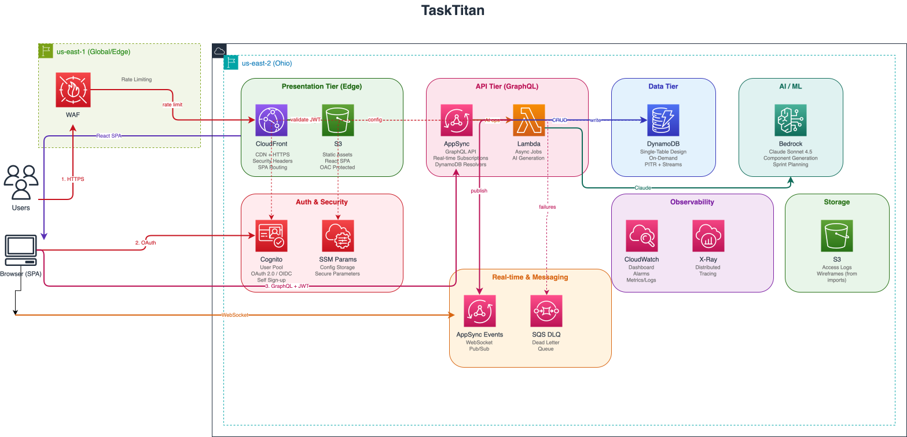

# TaskTitan - AI-Powered Project Planning

[](https://github.com/annabook21/TaskTitan/actions/workflows/build.yml)

TaskTitan is an AI-powered project planning tool that helps development teams break down projects into manageable components, track decisions, visualize dependencies, and coordinate sprints — eliminating merge conflicts before they happen.

## Features

### Core Planning
- **Component Hierarchy**: Organize work as Epics → Features → Stories → Tasks/Bugs
- **Dependency Visualization**: Interactive graph showing how components relate
- **Sprint Management**: Plan and track time-boxed iterations with capacity planning
- **Team Assignment**: Assign team members with availability and capacity tracking

### AI-Powered Features
- **Smart Component Generation**: Describe your project and let AI suggest the architecture
- **Natural Language Creation**: Create components from plain English descriptions
- **Component Refinement**: Chat with AI to break down and improve components
- **Wireframe Preview**: Generate UI mockups from component descriptions
- **Sprint Planning**: AI suggests which backlog items to include based on priority and dependencies
- **Retrospective Analysis**: AI analyzes sprint performance and suggests improvements

### Team Collaboration
- **Decision Journal**: Document why decisions were made, not just what
- **Real-time Updates**: Live sync when team members make changes
- **GitHub Integration**: Link PRs to components with automatic status updates
- **Team Metrics**: Track cycle time, throughput, and status distribution

### Workflow Support
- **Scrum**: 2-week sprints with planning and retrospectives
- **Kanban**: Continuous flow with WIP limits
- **Shape Up**: 6-week cycles with cooldown periods
- **Custom**: Configure your own workflow settings

## Architecture

TaskTitan FORGE v3 is built on a fully serverless AWS architecture — no VPC, NAT Gateway, or ALB required:



> For detailed architecture documentation including AWS Well-Architected alignment, see [ARCHITECTURE.md](ARCHITECTURE.md).

### Key Technologies

| Layer | Technology |
|-------|------------|
| Frontend | Vite + React 18, Tailwind CSS, React Router |
| CDN | Amazon CloudFront (edge caching, security headers) |
| API | AWS AppSync GraphQL (Cognito + API Key auth) |
| Database | Amazon DynamoDB (single-table design with ElectroDB) |
| Async Jobs | AWS Lambda (ARM64, Docker, 10-min timeout) |
| Auth | Amazon Cognito (User Pool, OAuth 2.0) |
| Real-time | AWS AppSync Events (WebSocket pub/sub) |
| AI | Amazon Bedrock (Claude Sonnet 4.5) |
| Security | AWS WAF (rate limiting, no payload inspection) |
| Infrastructure | AWS CDK (TypeScript, two-stack deployment) |
| Observability | CloudWatch Dashboard, X-Ray Tracing |

### Cost Estimate

| Service | Monthly Cost |
|---------|-------------|
| CloudFront | ~$5-15 |
| AppSync | ~$5-20 |
| DynamoDB (on-demand) | ~$5-25 |
| Lambda (async jobs) | ~$1-10 |
| WAF | ~$5-10 |
| Other (Cognito, CloudWatch, S3) | ~$3-10 |
| **Total** | **~$25-90/month** |

## Prerequisites

- [Node.js](https://nodejs.org/) >= v20
- [Docker](https://docs.docker.com/get-docker/)
- [AWS CLI](https://docs.aws.amazon.com/cli/latest/userguide/getting-started-install.html) configured with credentials

## Local Development

### Frontend (Vite + React)

1. **Install dependencies**:
   ```bash
   cd webapp-static
   npm install
   ```

2. **Create `.env.local`** from example:
   ```bash
   cp .env.example .env.local
   # Edit .env.local with your AppSync and Cognito endpoints
   ```

3. **Start the development server**:
   ```bash
   npm run dev
   ```

4. Open [http://localhost:5173](http://localhost:5173)

### Backend (Lambda handlers)

The Lambda handlers in `webapp/src/jobs/` use the AI generators from `webapp/src/lib/ai/`. These are deployed as Docker containers and don't require local setup for frontend development.

For local backend testing:
```bash
cd webapp
npm install
# Lambda handlers are built during CDK deploy
```

## Deploy to AWS

### First-time Setup

```bash
cd cdk
npm ci
npx cdk bootstrap
```

### Deploy

```bash
npx cdk deploy --all
```

Initial deployment takes approximately 10-15 minutes (two stacks: WAF in us-east-1, main in us-east-2). After deployment, you'll see output like:

```
TaskTitanWafStack.WebACLArn = arn:aws:wafv2:us-east-1:...
TaskTitanForgeStack.FrontendURL = https://xxxxxxxxxx.cloudfront.net
TaskTitanForgeStack.GraphQLEndpoint = https://xxxxxxxxxx.appsync-api.us-east-2.amazonaws.com/graphql
TaskTitanForgeStack.CognitoUserPoolId = us-east-2_xxxxxx
TaskTitanForgeStack.DynamoDBTableName = TaskTitanForgeStack-TaskTitanTable-xxxxxx
```

### AI Features

AI features are powered by Amazon Bedrock with Claude Sonnet 4.5. No external API keys are needed — everything runs within AWS. Ensure your AWS account has Bedrock model access enabled for the Claude models in us-east-2.

## Project Structure

```
├── cdk/                        # AWS CDK infrastructure
│   ├── bin/cdk.ts              # Stack entry point (WAF + Main stacks)
│   ├── lib/
│   │   ├── main-stack.ts       # Main stack orchestration
│   │   ├── waf-stack.ts        # WAF stack (us-east-1)
│   │   └── constructs/         # CDK constructs
│   │       ├── static-frontend.ts  # CloudFront + S3
│   │       ├── appsync-graphql.ts  # AppSync API + resolvers
│   │       ├── dynamodb.ts         # DynamoDB table
│   │       ├── async-job.ts        # Lambda async jobs
│   │       ├── auth/               # Cognito authentication
│   │       ├── event-bus/          # AppSync Events (real-time)
│   │       └── monitoring.ts       # CloudWatch dashboard
│   └── test/                   # Infrastructure tests
│
├── webapp-static/              # Vite + React frontend (deployed)
│   ├── src/
│   │   ├── api/                # AppSync GraphQL client
│   │   ├── components/         # React components
│   │   ├── pages/              # Route pages
│   │   └── hooks/              # Custom React hooks
│   └── public/                 # Static assets
│
└── webapp/                     # Backend code (Lambda handlers)
    └── src/
        ├── lib/
        │   ├── ai/             # Bedrock AI generators
        │   └── dynamodb/       # ElectroDB entities
        └── jobs/               # Lambda async job handlers
```

## Data Model

TaskTitan uses a single-table DynamoDB design with ElectroDB for type-safe access:

```
User ──┬── Membership ──── Team ──┬── Project ──┬── Component ──┬── Assignment
       │                          │             │               │
       └── Activity ◀─────────────┘             │               └── Dependency
                                                │
                                                └── Sprint
```

- **User**: Authenticated users (Cognito)
- **Team**: Groups with roles (Owner, Admin, Member, Viewer)
- **Project**: Software project being planned
- **Component**: Work items (Epic, Feature, Story, Task, Bug)
- **Sprint**: Time-boxed iterations with capacity
- **Dependency**: Relationships between components
- **Assignment**: Who is responsible for each component

## Contributing

1. Fork the repository
2. Create a feature branch
3. Make your changes
4. Run tests:
   - Frontend: `cd webapp-static && npm run build`
   - Infrastructure: `cd cdk && npm test`
5. Submit a pull request

## License

MIT License - see [LICENSE](LICENSE) for details.
