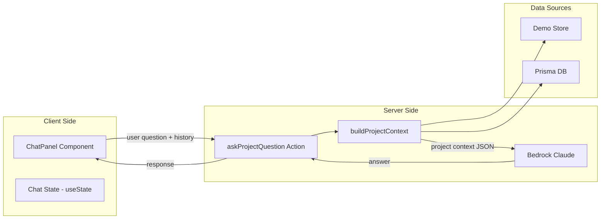

# Project Context AI Chatbot

## Research Findings - AWS Best Practices

### Use Converse API (Not InvokeModel)

Per AWS documentation, the **Converse API** is the recommended approach for chatbots:

- Built-in multi-turn conversation support via `messages` array
- Unified API across Claude models
- Structured `system`, `user`, `assistant` roles
- First-class guardrails support
- Streaming via `ConverseStreamCommand`

### Conversation History Management

- **Sliding window**: Keep last 5-10 turns to avoid context bloat
- **Summarization**: For long conversations, summarize older turns
- Claude context window: 200K tokens default (sufficient for project context + history)

### Cost & Performance

- Use `maxTokens` limit (e.g., 1024) to control response length
- Consider **Claude Haiku** for faster responses at lower cost
- Temperature 0.7 for balanced creativity/consistency

### React Chat UI Best Practices

- **Buffered streaming**: Don't re-render on every token; batch updates
- **Separate streaming state**: Keep in-flight message separate from history
- **Auto-scroll**: Snap to bottom only when user is at bottom
- **Loading indicators**: Show typing animation while AI responds
- **Accessibility**: ARIA live regions for screen readers

## Architecture Overview



## Files to Create/Modify

### 1. New: Chat Generator

**File:** `webapp/src/lib/ai/generators/project-chat-generator.ts`

Uses AWS Bedrock **Converse API** (recommended for chat per AWS docs):

```typescript
import { ConverseCommand } from "@aws-sdk/client-bedrock-runtime";

const command = new ConverseCommand({
  modelId: MODEL_ID,
  system: [{ text: systemPromptWithProjectContext }],
  messages: conversationHistory,  // Built-in multi-turn support
  inferenceConfig: { maxTokens: 1024, temperature: 0.7 }
});
```

- System prompt includes full project context (team, tasks, sprints, assignments)
- Conversation history limited to last 10 turns (sliding window per AWS best practices)
- Uses existing `getBedrockClient()` and `MODEL_ID`

### 2. New: Chat Server Action

**File:** `webapp/src/app/projects/actions/project-chat.ts`

- `askProjectQuestion` action accepting:
  - `projectId: string`
  - `question: string`
  - `conversationHistory: Array<{role: 'user' | 'assistant', content: string}>`
  - `demoProjectData?: {...}` (for demo mode)
- Builds full project context from DB (prod) or demo store (demo)
- Calls the chat generator
- Returns AI response

### 3. New: Chat Panel Component

**File:** `webapp/src/app/projects/[id]/components/ProjectChatPanel.tsx`

- Collapsible side panel (slides in from right)
- Chat message list with user/assistant bubbles
- Input field with send button
- Conversation state stored in `useState` (session-based)
- Toggle button fixed in corner
- Responsive design

### 4. Modify: Project Page Layout

**File:** `webapp/src/app/projects/[id]/page.tsx`

- Add `ProjectChatPanel` component
- Pass `projectId` prop

### 5. Modify: Demo Project Page

**File:** `webapp/src/app/projects/[id]/DemoProjectDetailPage.tsx`

- Add `ProjectChatPanel` component for demo mode

### 6. Export from AI index

**File:** `webapp/src/lib/ai/index.ts`

- Export new `askProjectChatQuestion` function

## Context Data Structure

The AI will receive a structured summary of:

```
Project: [name]
Description: [description]

Team Members:
- Randy (Developer) - 3 tasks assigned
- Alice (Designer) - 2 tasks assigned

Components (Work Items):
- [Component Name] | Type: STORY | Status: IN_PROGRESS | Assigned: Randy | Sprint: Sprint 1 | Est: 8h
- ...

Sprints:
- Sprint 1 (Active) | Jan 15-29 | 5 items, 2 completed
- ...

Recent Activity:
- Randy completed "Setup Database" 2 days ago
- ...
```

## UI Design

- **Collapsed state:** Small floating button with chat icon in bottom-right of project page
- **Expanded state:** 400px wide panel sliding in from right with:
  - Header with "Project Assistant" title and close button
  - Scrollable message area with alternating user/AI bubbles
  - Input area with text field and send button
  - Typing indicator animation while AI responds
  - Auto-scroll to bottom (only when user is at bottom)

### React Implementation (per best practices research)

```typescript
// Separate streaming state from history
const [messages, setMessages] = useState<Message[]>([]);
const [isLoading, setIsLoading] = useState(false);
const [pendingResponse, setPendingResponse] = useState('');

// Auto-scroll only when at bottom
const messagesEndRef = useRef<HTMLDivElement>(null);
const isAtBottom = useRef(true);

// Limit history to last 10 turns for API calls
const historyForAPI = messages.slice(-20); // 10 user + 10 assistant
```

## Demo Mode Support

- Chat will work in demo mode using the same pattern as other AI features
- `demoProjectData` passed from client containing full project context from localStorage
- Real Bedrock AI called for both demo and production